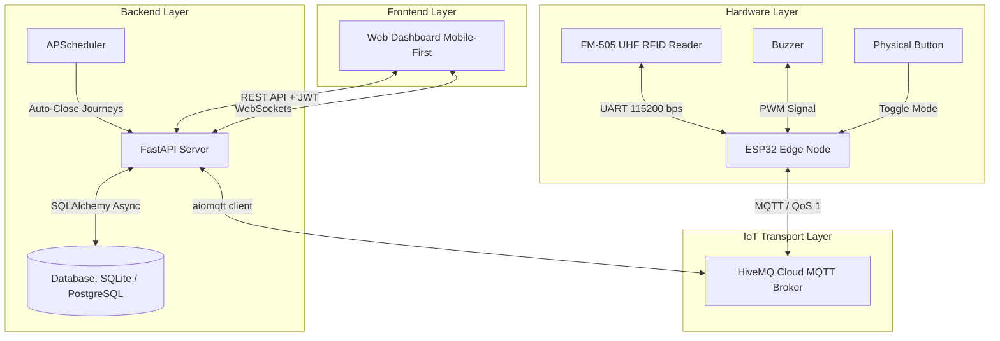

# SmartStock: IoT RFID-Enabled Textile Inventory Management System

SmartStock is a production-grade IoT inventory tracking ecosystem custom-built for micro-textile enterprises. It automates inventory checks, transit tracking, and sales projections in real-time, eliminating manual record-keeping entirely.

By deploying a physical UHF RFID gateway at the warehouse exit/entry points, SmartStock reads tags automatically as items cross, syncing data instantly with a responsive, zero-dependency, mobile-first Web Dashboard.

---

## System Architecture

The following diagram illustrates the flow of hardware inputs, bidirectional MQTT messaging, backend business logic, and sub-second updates propagated to the client dashboard:



---

## Core Capabilities

- **Deduplicated Scanning**: The ESP32 edge node executes localized RFID tag deduplication in 2-second windows and aggregates readings in 500ms batches to prevent telemetry storms.
- **Bi-Directional Command Sync**: Uses HiveMQ Cloud MQTT (QoS 1) to broker instant status synchronization and mode switching (e.g. changing portal mode from the dashboard).
- **Asynchronous & Atomic Transactions**: Backend event-batch parsing operates under a single atomic transaction. Database rollbacks execute automatically if any item fails to process.
- **Automatic Reconciliation**: Leverages `APScheduler` to run a daily automatic journal closure. Items left "In Transit" are automatically marked as "Sold" and deducted from inventory.
- **Smart Tag Association**: Interactive registration workflow via WebSockets. It detects duplicate allocations and guides the administrator in resolving ownership conflicts directly from the UI.
- **Real-Time Visual Indicators**: Seamless WebSockets connectivity provides sub-second UI status changes without HTTP polling.

---

## Project Structure

```text
smartstock/
├── backend/                  # FastAPI Application, Database Models, and REST/WS Routers
│   ├── app/                  # Main backend codebase (models, schemas, core configurations)
│   ├── tests/                # Automated pytest suite (integration, mocks, and routers)
│   └── requirements.txt      # Python dependencies
├── firmware/                 # C++ firmware for ESP32 utilizing PlatformIO
│   ├── src/                  # Hardware logic, UART parser, and MQTT subscriptions
│   └── platformio.ini        # Target build configurations, partitions, and dependencies
├── frontend/                 # Zero-Framework Mobile-First Frontend (Vanilla JS)
│   ├── css/                  # Styling modules (Sleek CSS architecture)
│   ├── js/                   # Front-end components, WebSocket hooks, and state managers
│   └── package.json          # Node scripts and esbuild development toolchain
├── PRD.md                    # Canonical Product Requirements Document
├── ARCH.md                   # System Architecture Specification
└── agents.md                 # Project-scoped developer instructions and rules
```

---

## Getting Started

### 1. Backend Setup

The FastAPI backend manages the state engine, serves the REST API, and acts as an MQTT-to-WebSocket bridge.

#### Prerequisites
- Python 3.10+
- Virtualenv or `uv` package manager

#### Setup Steps
1. Navigate to the backend directory:
   ```bash
   cd backend
   ```
2. Create and activate a virtual environment:
   ```bash
   python -m venv venv
   # On Windows (PowerShell):
   .\venv\Scripts\Activate.ps1
   # On macOS/Linux:
   source venv/bin/activate
   ```
3. Install required packages:
   ```bash
   pip install -r requirements.txt
   ```
4. Copy the environment template and fill in the required credentials:
   ```bash
   cp .env.example .env
   ```
5. Run the development server:
   ```bash
   python run.py
   ```
   The API documentation will be available at `http://127.0.0.1:8000/docs`.

---

### 2. Web Dashboard Setup

The frontend is served directly by the FastAPI backend in production, but a hot-reloading development server is included.

#### Prerequisites
- Node.js 18+

#### Setup Steps
1. Navigate to the frontend directory:
   ```bash
   cd frontend
   ```
2. Install build-time dev dependencies:
   ```bash
   npm install
   ```
3. Launch the esbuild-driven development compiler:
   ```bash
   npm run dev
   ```
4. (Optional) Run the API mock server for isolated UI development:
   ```bash
   npm run mock
   ```

---

### 3. Firmware Configuration

The ESP32 firmware monitors the UART reader line, commands physical status LEDs/buzzers, and handles portal states.

#### Setup Steps
1. Open the `firmware` directory in **VS Code** with the **PlatformIO** extension installed.
2. Configure your WiFi credentials and MQTT Broker parameters in your target source files (`firmware/src/config.h` or equivalent setup).
3. Connect the ESP32 board via USB.
4. Compile and flash the code:
   - Click the PlatformIO **Build** button (or run `pio run` in terminal).
   - Click the PlatformIO **Upload** button (or run `pio run --target upload` in terminal).
5. Open the Serial Monitor at `115200` bps to debug hardware startup and NTP clock sync.

---

## Core Configuration & Variables

Before running, create your backend `.env` file with these values:

```ini
# Database: Default to SQLite for local development
DATABASE_URL=sqlite+aiosqlite:///../smartstock.db

# Auth: Secret key for signing JWT tokens
JWT_SECRET=your_super_secret_hex_token

# MQTT Broker (HiveMQ Cloud credentials)
MQTT_BROKER_URL=your-broker-hostname.hivemq.cloud
MQTT_PORT=8883
MQTT_USERNAME=your_mqtt_username
MQTT_PASSWORD=your_mqtt_password
MQTT_DEVICE_ID=smartstock_backend_service
```

---

## Testing Suite

All tests must pass before integration. Testing is structured across backend API scopes and frontend UI modules.

### Running Backend Tests
Execute pytest with asynchronous database support inside the active virtual environment:
```bash
cd backend
pytest
```

### Running Frontend Tests
Launch integration and end-to-end user-flow validation via Playwright:
```bash
cd frontend
npm run test
# Run Playwright UI browser tests
npm run test:e2e
```

---

## Contributing and Standards

SmartStock enforces strict development rules to ensure codebase reliability. Read [agents.md](file:///c:/Users/misae/smartstock/agents.md) before writing code.

1. **Atomic DB Commits**: Any inventory state mutation triggered via an MQTT batch must succeed in its entirety or roll back completely.
2. **Batching RFID Inputs**: Telemetry data must be aggregated at the hardware level in 500ms windows. Individual MQTT publishes per read are prohibited.
3. **No Frontend Frameworks**: The user dashboard must remain lightweight, modular, and use **Vanilla JS** (Zero React, Vue, or Angular allowed). WebSockets are mandatory for real-time synchronization.
4. **Conventional Commits**: Commit messages must follow structured prefixes (e.g., `feat:`, `fix:`, `docs:`, `refactor:`).
