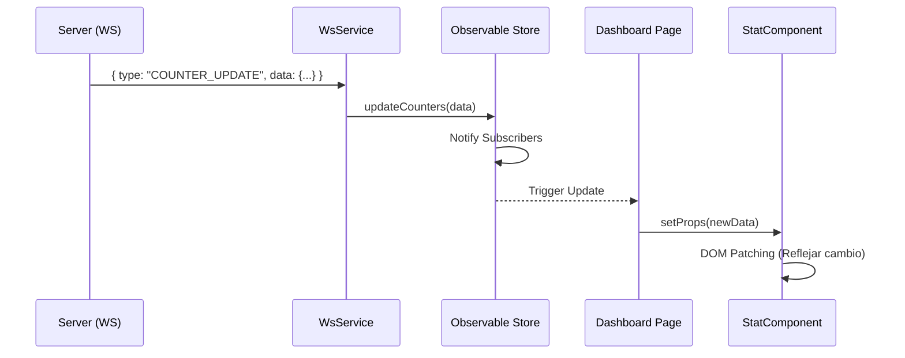

# M5 — Frontend (Web) — Plan de Ejecución Robusto

## 1. Estado Actual del Frontend (Post-M4)

| Componente | Estado | Ubicación Real | Observación |
|------------|--------|----------------|-------------|
| **HTML** | Pendiente | `/frontend/*.html` | No se detectaron archivos físicos. |
| **CSS** | Pendiente | `/frontend/css/*.css` | Directorio vacío. |
| **JS Vanilla** | Pendiente | `/frontend/js/*.js` | Directorio vacío. |
| **Tooling** | Pendiente | `package.json` | No existe configuración de Node.js. |
| **Assets** | Pendiente | `/frontend/assets/` | Pendiente de organización. |

> [!IMPORTANT]
> A pesar de que planes anteriores indicaban un estado "Completo" para el HTML, la auditoría actual revela que el frontend está en **fase cero**. Este plan asume el inicio desde el "Greenfield".

---

## 2. Arquitectura de Software (Atomic Vanilla)

Para evitar el "Spaghetti Code" típico de Vanilla JS, implementaremos un patrón **Component-Based** sin frameworks.

### 2.1 Estructura de Directorios
```text
frontend/
├── css/                # Design System (Variables, Reset, Layout)
├── js/
│   ├── components/     # Átomos y Moléculas (Botones, Cards, Tabla)
│   ├── services/       # Lógica de API (REST) y WebSocket
│   ├── store/          # Estado global reactivo (Pub/Sub)
│   ├── utils/          # Helpers (Formatters, DOM helpers)
│   ├── pages/          # Organismos (Dashboard, Inventory, Settings)
│   ├── router.js       # Router SPA (Hash-based)
│   └── app.js          # Punto de entrada
├── public/             # Assets estáticos (Images, Icons, Manifest)
├── tests/              # Unit (Jest) & E2E (Playwright)
├── esbuild.config.js   # Bundler & Minifier
└── package.json        # Dependencias de desarrollo
```

### 2.2 Patrones de Diseño
1.  **BaseComponent**: Clase base para encapsular el renderizado y el ciclo de vida.
2.  **Observable Store**: Para que el Dashboard se actualice automáticamente cuando llegue un mensaje de WebSocket sin necesidad de pasar datos manualmente entre componentes.
3.  **Container-Presentational**: Las `pages` manejan la lógica (data fetching), los `components` solo renderizan.

---

## 3. Gap Analysis & Riesgos

| Gap | Riesgo | Mitigación |
|-----|--------|------------|
| **Sin Toolchain** | Código no minificado, sin soporte para módulos ES modernos en navegadores viejos. | Implementar `esbuild` para bundling y minificación sin complicar el despliegue. |
| **WebSocket Latency** | Desincronización entre lo que ve el usuario y la realidad de la BD. | Implementar ACKs en el cliente y un indicador de "Estado de Conexión" (Online/Offline). |
| **XSS / Injection** | Manipulación manual del DOM con `innerHTML` es peligrosa. | Uso estricto de `textContent` o un sanitizador ligero. |

---

## 4. Cronograma de Ejecución (Fases)

### Fase 0: Tooling & Fundaciones (SOLID)
- [x] **0.1** Inicializar `npm init -y` y configurar `package.json`.
- [x] **0.2** Configurar `esbuild` para soporte de `import/export` (bundling).
- [x] **0.3** Crear `Design System` en CSS (Variables HSL, Typography Inter).
- [x] **0.4** Implementar `BaseComponent.js` y `Store.js`.

### Fase 1: Servicios de Comunicación
- [x] **1.1** `ApiService.js`: Wrapper de `fetch` con interceptores para JWT (Auth).
- [x] **1.2** `WsService.js`: Gestión de `WebSocket` nativo con reconexión exponencial y heartbeat.
- [x] **1.3** Mock Server: Configurar un script simple para simular eventos de tag RFID sin depender del backend.

### Fase 2: Componentes Atómicos & Layout
- [x] **2.1** Layout Principal: Sidebar, Navbar (con indicador de modo del portal).
- [x] **2.2** Componentes: `StatCard` (contadores), `InventoryTable`, `AlertBadge`.
- [x] **2.3** Formularios: Login y Configuración del Ciclo.

### Fase 3: Lógica de Negocio (Pages)
- [x] **3.1** **Dashboard**: Suscripción al Store para actualizaciones `COUNTER_UPDATE` en tiempo real.
- [x] **3.2** **Inventario**: CRUD de productos y visualización de etiquetas por producto.
- [x] **3.3** **Alertas**: Notificaciones toast para `TAG_DESCONOCIDA` o `TIEMPO_EXCEDIDO`.

### Fase 4: Optimización & PWA
- [x] **4.1** **Service Worker**: Cachear el "App Shell" para carga instantánea.
- [x] **4.2** **Lazy Loading**: Los componentes de las páginas se cargan solo cuando se navega a ellas.
- [x] **4.3** **A11y**: Auditoría de contraste y navegación por teclado (DoD AA).

### Fase 5: Testing & QA (TDD)
- [x] **5.1** Unit Tests: Validar lógica de los formatters y el Store.
- [x] **5.2** Integration Tests: Simular flujo de Login -> Cambio de Modo -> Ver actualización.
- [x] **5.3** E2E Tests: Validar que el WebSocket actualiza el DOM correctamente (Playwright).

---

## 5. Criterios de Aceptación (DoD)

### Performance (Core Web Vitals)
- **LCP (Largest Contentful Paint)**: < 1.2s.
- **CLS (Cumulative Layout Shift)**: < 0.1.
- **Bundle Size**: < 150KB (Gzipped) para el core.

### Seguridad
- **CSP**: Content Security Policy configurada para bloquear scripts externos no autorizados.
- **Sanitización**: Cero uso de `innerHTML` con datos provenientes de la API.

### Funcionalidad Real-Time
- El dashboard debe reflejar un cambio de contador en < 200ms tras la recepción del mensaje WS.
- Indicador visual claro cuando el WebSocket se desconecta.

---

## 6. Diagrama de Flujo de Datos (Frontend)



---

## 7. Entregables Finales
1.  `frontend/dist/`: Bundle optimizado y listo para ser servido por FastAPI.
2.  `frontend/tests/report.html`: Reporte de cobertura y pruebas e2e.
3.  `frontend/PWA/`: Manifest y Service Worker funcional.
4.  `frontend/docs/ARCHITECTURE.md`: Guía para futuros desarrolladores sobre el patrón de componentes.

---
*Este plan ha sido auditado para cumplir con el requerimiento de "Sin Frameworks JS" pero con rigor de "Senior Architect".*