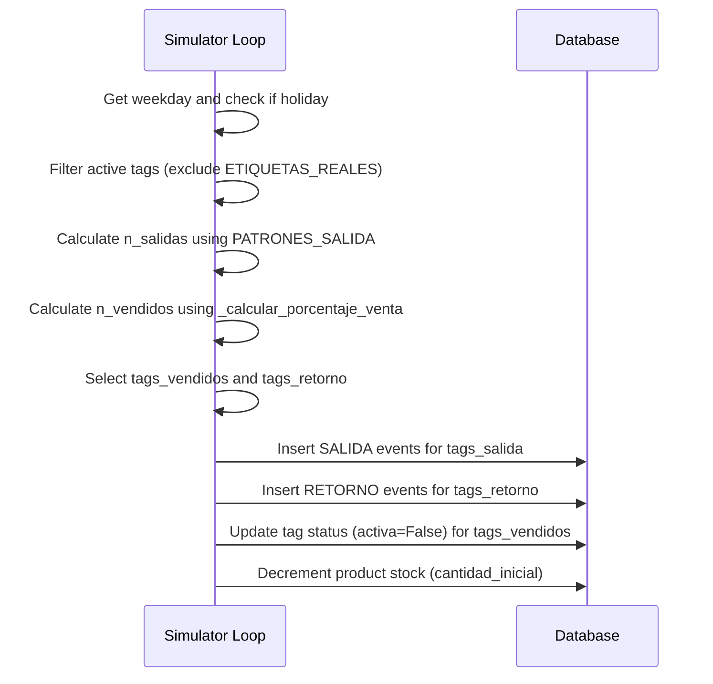

# Design: Realistic Simulation History

## Technical Approach
Modify `backend/scripts/simulate_history.py` to stabilize the daily sales simulation. Specifically:
1. Update `PATRONES_SALIDA` and `PATRONES_VENTA` constants to follow a stable weekly distribution.
2. Update holiday conversion rates in `_calcular_porcentaje_venta` to prevent extreme inventory depletion.
3. Validate that real RFID tags (`ETIQUETAS_REALES`) are never marked sold or deactivated.

## Architecture Decisions

| Decision | Options Considered | Tradeoffs | Selected Option & Rationale |
|----------|--------------------|-----------|-----------------------------|
| **Weekly Pattern Scaling** | Option 1: Adjust daily rates via configuration dictionary.<br>Option 2: Decoupled target sales volume generation. | **Option 1**: Simple configuration change, preserves portal event simulation.<br>**Option 2**: Over-complicates script logic, bypasses portal-first emulation. | **Option 1**. Preserves physical portal flow while keeping weekly sales distributions stable. |
| **Real Tag Protection** | Option 1: Filter in-memory when building `tags_en_stock`.<br>Option 2: Exclude in database queries. | **Option 1**: Highly efficient, leverages memory cache, already implemented.<br>**Option 2**: Adds database queries and overhead. | **Option 1**. Excludes `EPCS_REALES` from candidate pools, ensuring they never deactivate. |

## Data Flow



## File Changes

| File | Action | Description |
|------|--------|-------------|
| `backend/scripts/simulate_history.py` | Modify | Update `PATRONES_SALIDA` and `PATRONES_VENTA` dictionaries. Update holiday conversion logic in `_calcular_porcentaje_venta`. |

### Detailed Code Modifications

#### 1. Constants `PATRONES_VENTA` and `PATRONES_SALIDA`
```python
PATRONES_VENTA = {
    0: 0.10,  # Lunes
    1: 0.10,  # Martes
    2: 0.20,  # Miércoles
    3: 0.12,  # Jueves
    4: 0.20,  # Viernes
    5: 0.30,  # Sábado
    6: 0.30,  # Domingo
}

PATRONES_SALIDA = {
    0: (0.20, 0.30),  # Lunes
    1: (0.20, 0.30),  # Martes
    2: (0.35, 0.45),  # Miércoles
    3: (0.25, 0.35),  # Jueves
    4: (0.35, 0.45),  # Viernes
    5: (0.45, 0.55),  # Sábado
    6: (0.45, 0.55),  # Domingo
}
```

#### 2. Holiday Conversion Rates in `_calcular_porcentaje_venta`
```python
    def _calcular_porcentaje_venta(self, fecha: date) -> float:
        """Porcentaje de unidades salidas que se venden (no retornan) con feriados de México."""
        dia = fecha.weekday()
        porcentaje = PATRONES_VENTA[dia]
        
        # --- Feriados y Festividades Mexicanas ---
        # 1 de Mayo: Día del Trabajo (Gran actividad en tianguis)
        if fecha == date(2026, 5, 1):
            porcentaje = 0.40
        # 5 de Mayo: Batalla de Puebla (Actividad media-alta)
        elif fecha == date(2026, 5, 5):
            porcentaje = 0.25
        # Pre-Día de las Madres (8 y 9 de Mayo: Furor extremo de compras de manteles, colchas, batas de regalo)
        elif fecha in [date(2026, 5, 8), date(2026, 5, 9)]:
            porcentaje = 0.45
        # 10 de Mayo: Día de las Madres (Ventas pico absolutas)
        elif fecha == date(2026, 5, 10):
            porcentaje = 0.50
        # 15 de Mayo: Día del Maestro (Movimiento extra en blancos)
        elif fecha == date(2026, 5, 15):
            porcentaje = 0.30
            
        return porcentaje
```

## Interfaces / Contracts
None.

## Testing Strategy

| Layer | What to Test | Approach |
|-------|-------------|----------|
| **Script Execution** | Database recreation and simulation execution | Run `python backend/scripts/simulate_history.py` and verify successful completion. |
| **Statistical Validation** | Saturday-to-Monday ratio | Verify that the Saturday-to-Monday sales volume ratio falls between 3.3x and 3.8x. |
| **Holiday Caps** | Conversion ceilings | Verify that holiday conversion rates never exceed 50%. |
| **Tag Safety** | Protection of ETIQUETAS_REALES | Query the database post-simulation to ensure no tag in `ETIQUETAS_REALES` has `activa = False` or has generated events. |

## Migration / Rollout
No database schema changes or migrations are required. Running the updated script recreates the database tables automatically.

## Open Questions
None.
