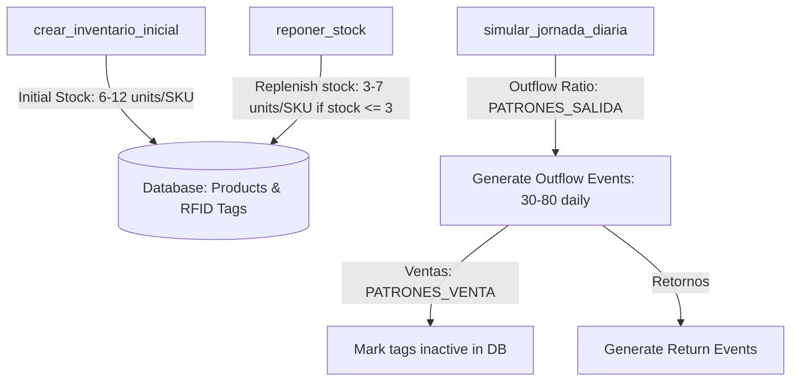

# Design: Reduced Capacity Simulation

## Technical Approach

Scale down the simulation constants in `backend/scripts/simulate_history.py` to transition the simulator from representing a large retail business with high inventory levels and high portal throughput to a small business/warehouse setup with lower stock capacities. 

This change scales the initial units generated per product SKU, updates the weekly vendor replenishment limits, and scales down the daily outbound portal movement ratios (`PATRONES_SALIDA`) to target a total daily portal transit count of 30-80 units on weekdays and up to ~90 on weekends.

## Architecture Decisions

### Decision: Simulation Scaling Strategy

| Decision Aspect | Option 1: Direct Constant Scaling | Option 2: External Configuration |
|---|---|---|
| **Description** | Modify the global constants in the script directly. | Move simulation configuration values to environment variables or config files. |
| **Tradeoffs** | Simple to implement, fast, and does not add runtime dependencies. | Offers flexibility, but adds script setup complexity for a developer utility tool. |
| **Recommendation** | **Chosen**. Option 1 aligns with the design of the script as a stand-alone, developer-controlled test data bootstrapper. | Reverted. The complexity of externalizing these constants does not yield real benefits. |

## Data Flow

1. **Initial Stock Generation**: The simulator seeds each of the 26 products with an initial stock generated randomly between 6 and 12 (formerly 20-40) units.
2. **Weekly Replenishment**: Every Monday, the script evaluates active stock levels. For any SKU whose stock falls below the minimum stock check threshold (`UNIDADES_INICIALES_MIN // 2 = 3` units), the script generates a supplier replenishment batch of 3 to 7 (formerly 10-20) units.
3. **Daily Movements**: Outflows are calculated as a fraction of active stock using `PATRONES_SALIDA`. The scaled percentages result in 30-80 outbound events per day (up to ~90 on weekends). Returns and sales are processed using the existing `PATRONES_VENTA` conversion rates.

## File Changes

| File | Action | Description |
|------|--------|-------------|
| `backend/scripts/simulate_history.py` | Modify | Update the values of `UNIDADES_INICIALES_MIN`, `UNIDADES_INICIALES_MAX`, `REPOSICION_UNIDADES_MIN`, `REPOSICION_UNIDADES_MAX`, and the `PATRONES_SALIDA` dictionary mapping. |

## Interfaces / Contracts

No public APIs, database schemas, or payload formats are altered.

## Testing Strategy

| Layer | What to Test | Approach |
|-------|-------------|----------|
| Integration | Simulator Execution & Metrics | Run `python backend/scripts/simulate_history.py` inside the virtual environment. Verify that the daily portal transit (outflow events) stays consistently between 30 and 80 events on weekdays, and up to ~90 on weekends. |
| Regression | Existing Test Suite | Execute `./venv/Scripts/pytest` to verify that all existing analytics, cycle calculations, and report tests pass with the scaled-down dataset. |

## Migration / Rollout

No database migrations or configuration steps are required.
