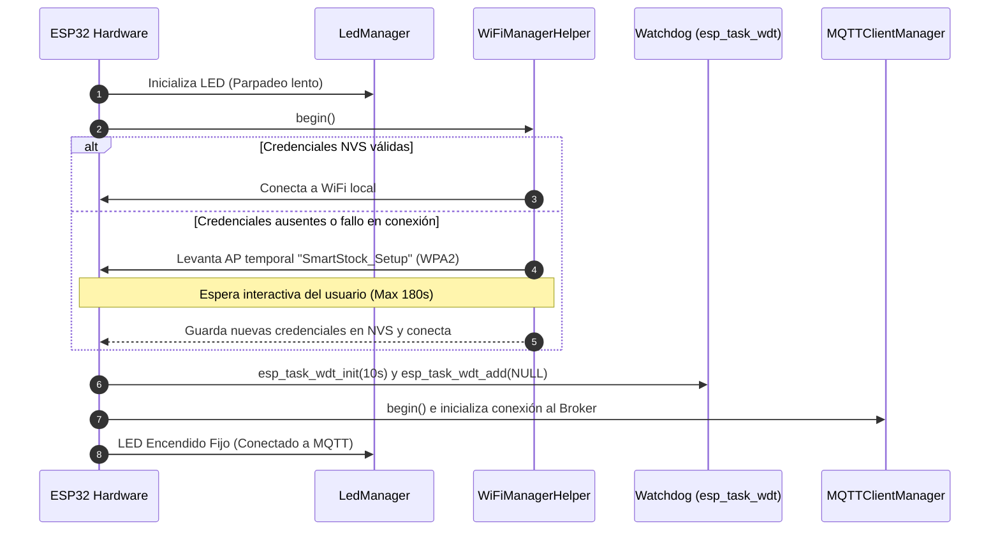
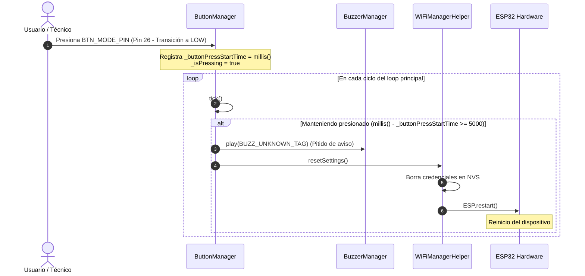

# Diseño Técnico: Aprovisionamiento Dinámico de WiFi

Este documento describe la arquitectura detallada, diagramas de secuencia e implementación a nivel de clases para la integración de WiFiManager y el reset de hardware por pulsación larga.

---

## 1. Diagramas de Flujo y Secuencia

### 1.1 Secuencia de Inicio (Boot Flow)

El inicio del ESP32 debe priorizar la conexión de red de forma segura antes de activar el Watchdog (WDT), evitando que el bloqueo del portal cautivo dispare resets no deseados.



### 1.2 Secuencia de Reset por Hardware (Long Press)



---

## 2. Cambios en las Interfaces de Clases

### 2.1 WiFiManagerHelper (`wifi_manager.h`)

Renombramos la interfaz de envoltura del WiFi para evitar cualquier colisión de alcance con la clase global `WiFiManager` de la librería externa:

```cpp
#pragma once
#include <Arduino.h>
#include <WiFi.h>
#include <WiFiManager.h>

class WiFiManagerHelper {
public:
    WiFiManagerHelper();
    void begin();
    void tick();
    bool isConnected();
    void resetSettings();

private:
    unsigned long _lastReconnectAttempt;
};
```

### 2.2 Extensiones en ButtonManager (`button.h`)

Para dar soporte a la pulsación larga del botón sin bloquear el hilo principal (manteniendo el diseño no bloqueante del firmware), agregamos variables privadas de control de tiempo:

```cpp
private:
    // ... Propiedades existentes ...
    unsigned long _buttonPressStartTime;
    bool _isPressing;
    bool _resetTriggered;
```

---

## 3. Lógica Paso a Paso del Botón en `tick()`

La detección del long press se integrará dentro del método `tick()` en `button.cpp`:

```cpp
void ButtonManager::tick() {
    int reading = digitalRead(BTN_MODE_PIN);
    
    // Filtro Debounce existente
    if (reading != _lastReading) {
        _lastDebounceTime = millis();
    }
    
    if ((millis() - _lastDebounceTime) > 50) {
        // Detectar cambio de estado físico
        if (reading != _buttonState) {
            _buttonState = reading;
            
            if (_buttonState == LOW) {
                // FLANCO DE BAJADA (Presionado)
                _buttonPressStartTime = millis();
                _isPressing = true;
                _resetTriggered = false;
            } else {
                // FLANCO DE SUBIDA (Soltado)
                if (_isPressing) {
                    unsigned long duration = millis() - _buttonPressStartTime;
                    
                    // Si se soltó ANTES de los 5 segundos y no se disparó el reset
                    if (duration < 5000 && !_resetTriggered) {
                        // Alternar modos (Comportamiento existente)
                        if (_currentMode == "SALIDA") {
                            setMode("RETORNO");
                        } else if (_currentMode == "RETORNO") {
                            setMode("APAGADO");
                        } else {
                            setMode("SALIDA");
                        }
                    }
                    _isPressing = false;
                }
            }
        }
    }
    
    // Monitoreo continuo mientras se mantiene presionado (fuera del cambio inmediato de estado)
    if (_isPressing && !_resetTriggered) {
        if ((millis() - _buttonPressStartTime) >= 5000) {
            _resetTriggered = true;
            
            // Sonido de alerta continuo e inicio de reset
            extern BuzzerManager buzzer; // Enlace al buzzer global
            buzzer.play(BUZZ_UNKNOWN_TAG); // Pitido indicativo de alarma
            
            extern WiFiManagerHelper wifi; // Enlace al wifi global
            wifi.resetSettings(); // Esto borra credenciales y hace ESP.restart()
        }
    }
    
    _lastReading = reading;
}
```
