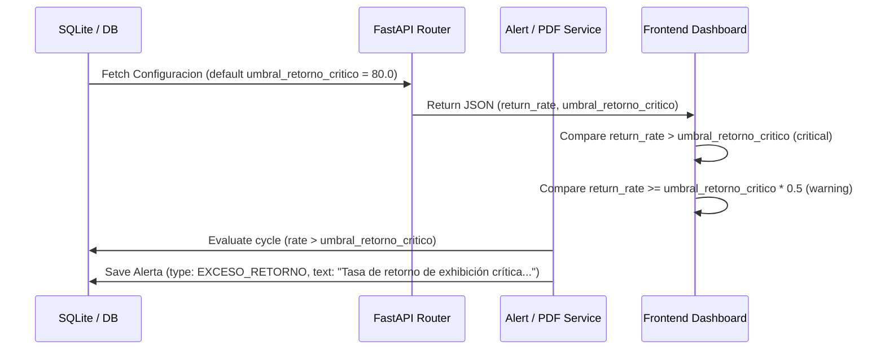

# Design: Return Rate Conceptual Fix

## Technical Approach

To align the RFID inventory tracking terminology with the physical reality of the textiles stand, the metric formerly known as "Tasa de Devoluciones" (implying customer refunds/returns) is renamed to "Tasa de Retorno de Exhibición" (representing unsold items returning to the warehouse). To avoid excessive false positives, the default critical alert threshold is raised from 20% to 80% dynamically across the backend database schemas, PDF report generation, history simulators, and frontend dashboard components.

## Architecture Decisions

| Decision | Options Considered | Tradeoffs / Rationale | Selected Decision |
| :--- | :--- | :--- | :--- |
| **API Field Backwards Compatibility** | Rename API fields (e.g. `return_rate` to `exhibition_return_rate`) vs Keep JSON key names | Renaming breaks api contracts and integration tests. Keeping key names maintains compatibility while text label adjustments happen at presentation. | Keep `return_rate` and `umbral_retorno_critico` JSON keys. Update docstrings and UI labels. |
| **Alert/Warning Threshold Logic** | Hardcoded frontend ratios vs Dynamic ratio checks relative to configuration | Hardcoded limits become out-of-sync when threshold changes. Fetching configuration threshold lets UI adapt dynamically. | Compute UI warnings dynamically relative to configured `umbral_retorno_critico` (e.g. warning at 50% of threshold). |

## Data Flow



## File Changes

| File | Action | Description |
|------|--------|-------------|
| `backend/app/models/configuracion.py` | Modify | Update model default for `umbral_retorno_critico` to `80.0`. Update SQL seed DDL event listener value to `80.0`. |
| `backend/app/schemas/configuracion.py` | Modify | Update Pydantic schemas default for `umbral_retorno_critico` to `80.0`. |
| `backend/app/routers/reports.py` | Modify | Change fallback for `umbral` to `80.0` in `get_products_return_rates`. Update docstrings. |
| `backend/app/services/alert_service.py` | Modify | Change fallback `umbral` to `80.0` in `evaluar_exceso_retorno_ciclo`. Update description format to use `"Tasa de retorno de exhibición crítica: ..."` and remove mention of customer returns. |
| `backend/app/services/pdf_service.py` | Modify | Rename PDF labels and headers to "Tasa de Retorno de Exhibición (Exhibition Return Rate)" and update Spanish empty state messages. |
| `backend/scripts/simulate_history.py` | Modify | Update default configuration seed and update calls to use `umbral_retorno_critico=80.0`. |
| `backend/tests/test_new_metrics.py` | Modify | Ensure test assertions match new terminology and verify default database values correctly seed to `80.0`. |
| `frontend/js/components/ProductDetailModal.js` | Modify | Rename section to "Tasa de Retorno de Exhibición" and set description to "Porcentaje de stock en exhibición que retornó a bodega sin venderse.". Update default state fallback to `80.0` and compute warning status color using `rate >= umbral * 0.5`. |
| `frontend/js/pages/ReportsPage.js` | Modify | Rename Widget title to "Tasa de Retorno de Exhibición (Exhibition Return Rate)" and description to include dynamic limits. Replace hardcoded 20% status checks with `rate > umbral` (critical) and `rate >= umbral * 0.5` (warning). |

## Interfaces / Contracts

The API schema response contract for `/api/reports/products/return-rates` remains backwards compatible:
```json
{
  "id": "uuid",
  "nombre": "string",
  "sku": "string",
  "categoria": "string",
  "total_salidas": 10,
  "total_retornos": 8,
  "return_rate": 80.0,
  "umbral_retorno_critico": 80.0,
  "excede_umbral": false
}
```

## Testing Strategy

| Layer | What to Test | Approach |
|-------|-------------|----------|
| Unit (Backend) | Default configuration values | Assert database default value for `umbral_retorno_critico` is seeded at `80.0`. |
| Integration (Backend) | Critical return alert triggering | Test `evaluar_exceso_retorno_ciclo` creates `EXCESO_RETORNO` alert with updated nomenclature when rate exceeds `80.0`. |
| E2E / UI (Frontend) | Dynamic visual status indicators | Assert styling applies `danger` class when rate > umbral, `warning` when rate >= umbral * 0.5, and `success` otherwise. |

## Migration / Rollout

No database migration scripts are needed because DDL setup defaults and configuration tables will be seeded upon startup via the upgraded models and simulation script.
