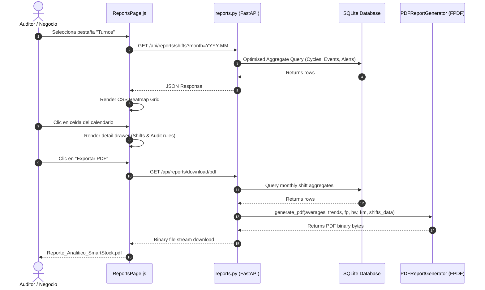

# Technical Design: Shift Analysis Reports (Turnos)

This document specifies the internal class structures, query optimizations, rendering sequences, and CSS structures for the Turnos analysis feature.

---

## 1. System Architecture & Data Flow



---

## 2. Optimized Database Aggregations

To prevent N+1 query patterns and avoid loading thousands of event rows into memory to count them, we separate the query into two high-performance phases:

```python
# 1. Fetch cycles in selected month
stmt = select(Ciclo).where(
    Ciclo.fecha >= start_date,
    Ciclo.fecha <= end_date
).order_by(desc(Ciclo.fecha), desc(Ciclo.creado_en))
cycles = (await db.execute(stmt)).scalars().all()
cycle_ids = [c.id for c in cycles]

# 2. Bulk aggregate events per cycle in a single query
eventos_data = {}
if cycle_ids:
    stmt_events = select(
        Evento.ciclo_id,
        func.sum(case((Evento.tipo == TipoEvento.SALIDA, 1), else_=0)).label("salidas"),
        func.sum(case((Evento.tipo == TipoEvento.RETORNO, 1), else_=0)).label("retornos")
    ).where(Evento.ciclo_id.in_(cycle_ids)).group_by(Evento.ciclo_id)
    res_events = await db.execute(stmt_events)
    eventos_data = {row.ciclo_id: (row.salidas, row.retornos) for row in res_events.all()}

# 3. Bulk fetch alerts per cycle in a single query
alertas_data = defaultdict(list)
if cycle_ids:
    stmt_alerts = select(Alerta).where(Alerta.ciclo_id.in_(cycle_ids)).order_by(Alerta.timestamp.asc())
    res_alerts = await db.execute(stmt_alerts)
    for a in res_alerts.scalars().all():
        alertas_data[a.ciclo_id].append({
            "tipo": a.tipo.value,
            "descripcion": a.descripcion,
            "timestamp": a.timestamp
        })
```

This ensures we run exactly **3 highly optimized index-supported queries** regardless of whether there are 10 or 100 shifts in that month.

---

## 3. Web UI Component Design (`ReportsPage.js`)

We will add a new tab to `ReportsPage.js` that manages the calendar's render state:

### 3.1 State Representation
```javascript
this.state = {
  activeTab: 'combos', // 'combos' | 'supply' | 'health' | 'turnos'
  shiftsReport: [],
  selectedMonth: new Date().toISOString().slice(0, 7), // "YYYY-MM"
  selectedDayShifts: null,
  selectedDayDate: null,
  isLoading: false,
  error: null
};
```

### 3.2 Dynamic Calendar Offset & Grid Generation
The calendar grid requires:
1. Day headers (Dom, Lun, Mar, Mié, Jue, Vie, Sáb).
2. Blank cells corresponding to the offset of the first day of the month.
3. Day cells from `1` to `N` (total days).

```javascript
const year = parseInt(selectedMonth.split('-')[0]);
const month = parseInt(selectedMonth.split('-')[1]);

// 1. Get first day of week (0 = Sunday, 6 = Saturday)
const firstDayOffset = new Date(year, month - 1, 1).getDay();

// 2. Get total days in month
const daysInMonth = new Date(year, month, 0).getDate();
```

Inside the loop, we map shifts matching `Ciclo.fecha === cellDate`.
- If shifts exist:
  - Check if any shift failed compliance (e.g. `duracion_segundos > 12 * 3600` or `cierre_automatico === true`).
  - Paint green (`.cell-success`) if all shifts are compliant.
  - Paint amber (`.cell-warning`) if any shift is forced-closed / auto-closed.
  - If any shift has alerts (`alertas_count > 0`), display a red bubble with the alert count.

---

## 4. PDF Layout Implementation (`pdf_service.py`)

To render the table elegantly in PDF format:

```python
# 1. Section Header
self.draw_section_header("V. AUDITORÍA Y ANÁLISIS DE TURNOS (MENSUAL)")

# 2. Banners / Summary Cards
y_start = self.get_y()
self.draw_card(
    title="Turnos Registrados",
    val=f"{len(shifts_data)} Turnos",
    desc="Total de ciclos de trabajo auditados en el mes.",
    x=15, y=y_start, w=90, h=20,
    accent_color=(108, 92, 231)
)
self.draw_card(
    title="Cierres Forzados",
    val=f"{sum(1 for s in shifts_data if not s['kpi_cumplido'])} Ciclos",
    desc="Turnos excedidos de tiempo o cerrados por el sistema.",
    x=110, y=y_start, w=90, h=20,
    accent_color=(245, 158, 11)
)

self.set_y(y_start + 23)

# 3. Table Header
self.set_fill_color(226, 232, 240)
self.set_font("helvetica", "B", 7.5)
self.cell(25, 6, " Fecha", border=1, fill=True)
self.cell(15, 6, " Turno ID", border=1, fill=True, align="C")
self.cell(45, 6, " Horario Activo (Inicio - Fin)", border=1, fill=True, align="C")
self.cell(20, 6, " Salidas", border=1, fill=True, align="C")
self.cell(20, 6, " Retornos", border=1, fill=True, align="C")
self.cell(20, 6, " Alertas", border=1, fill=True, align="C")
self.cell(40, 6, " Auditoría / Cumplimiento", border=1, fill=True, align="C", ln=1)

# 4. Table Rows
self.set_font("helvetica", "", 7.5)
for s in shifts_data:
    # Print columns
    ...
```
This keeps the design clean, consistent with previous tables, and highly professional.
